# STRAVA DATA: Weekly Running Plans & Progress
###### Joey Spronck
This repository tracks running progress and training plans. All data are updated via strava API.

These figures update automatically via GitHub Actions. See the [main branch](https://github.com/JoeySpronck/strava_data) for what this repo is and how it works.

---
### 🏃🚴🥾🏋️ All-Sports Overview
> Running, cycling, hiking, and strength stacked on a shared time axis. Color encodes speed (run/ride), carried weight (hike), and volume rate (strength). The injury timeline below running marks the week each injury started (abbreviations in its legend), with a faint orange band through that week in every sport panel.

  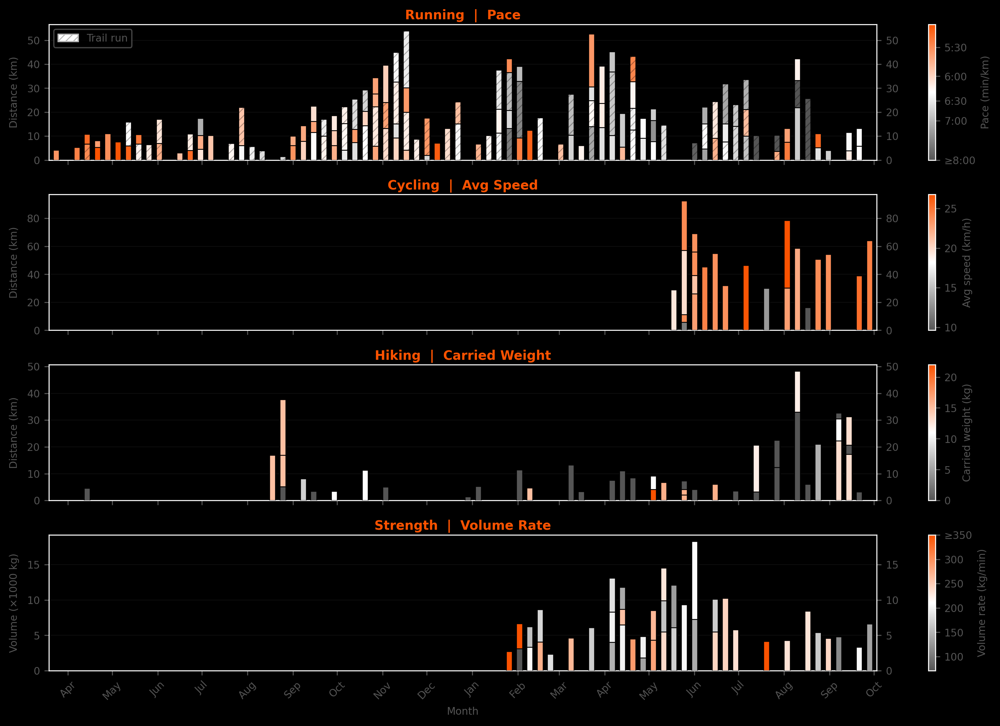

---
### 📅 Monthly Activity Calendar
> Strava-style month view: each day is a circle, filled on activity days (letter = sport: **T**rail, **R**un, **H**ike, **S**trength, **B**ike). Color and size follow the overview's metric scale and bar magnitude. All months archived in [`CALENDAR_PLOTS.md`](CALENDAR_PLOTS.md).

#### This month

  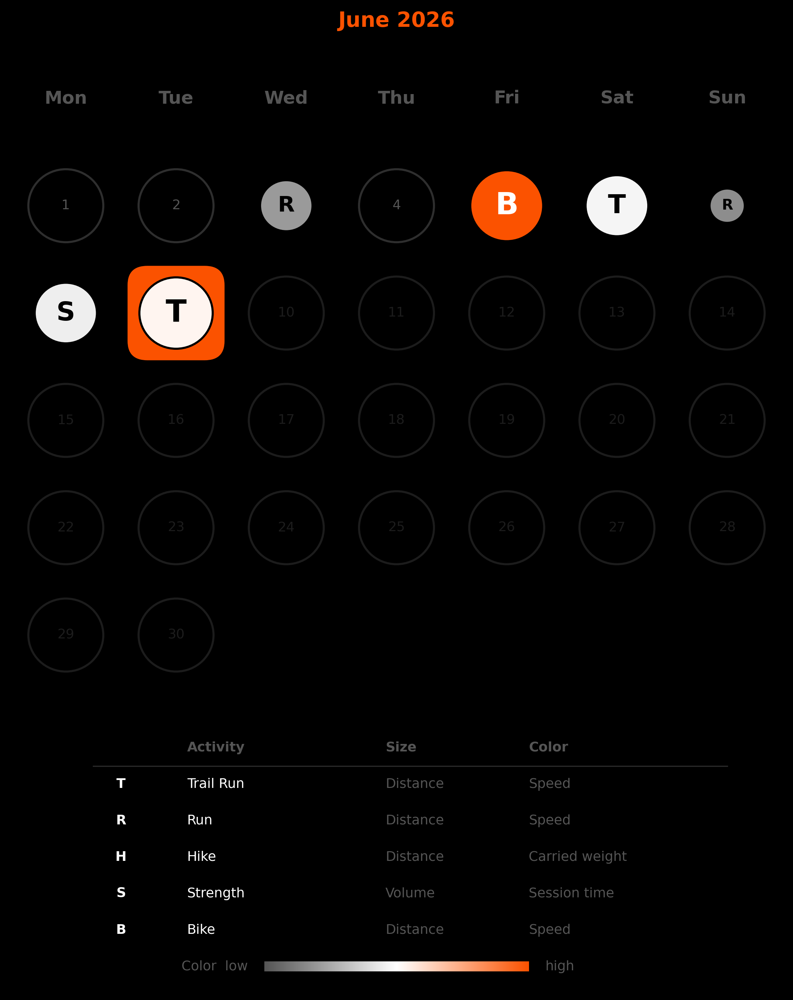

#### Previous month

  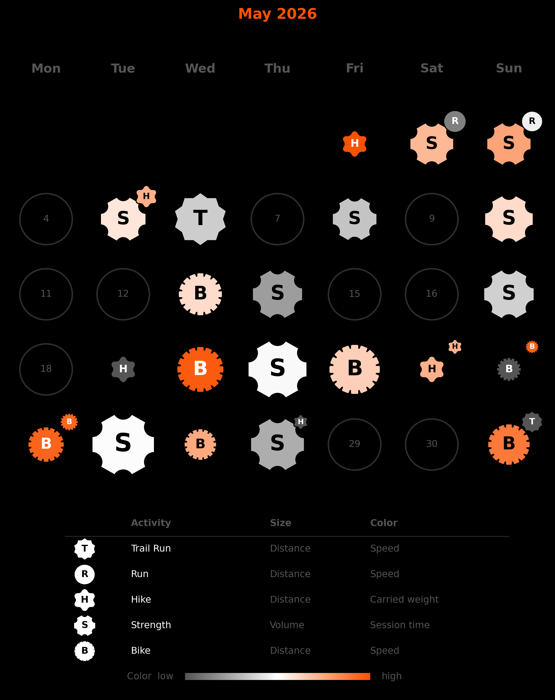

---
### 📉 Aerobic Decoupling
> Interactive, so it lives on the web dashboard rather than as a plot: drop in a run exported from Strava (.gpx or .fit), drag two intervals over it, and see how far efficiency drifted between them. The file is analysed in your browser and never uploaded. [Open the analyzer →](https://joeyspronck.github.io/strava_data/web/decoupling.html)

---
### 📈 Weekly volume progression
> Based on the 10% rule, but build-up grows at +25%/week while the target stays below the dark-gray dashed line — the highest 3-consecutive-week average volume of the last half year (a previously sustained level). Once a +25% step would reach that line, growth reverts to +10%. The next unreached target (this or next week) is used as the target for the following plots.

  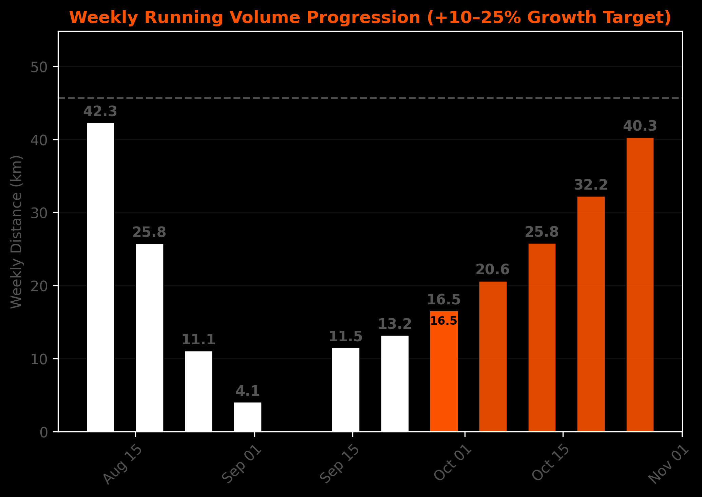

---
### Example Week Plans
> These plots show examples of how a week could be divided into multiple runs, given the target mileage.

  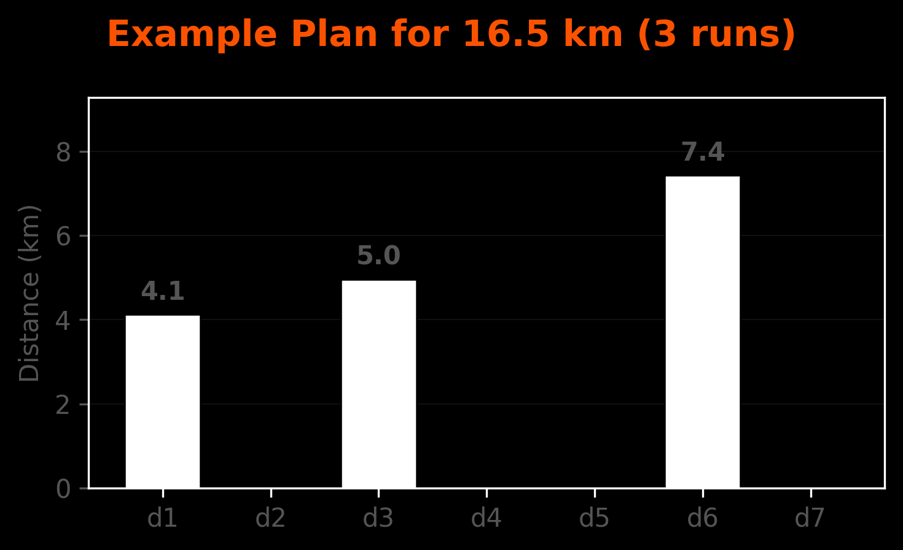

  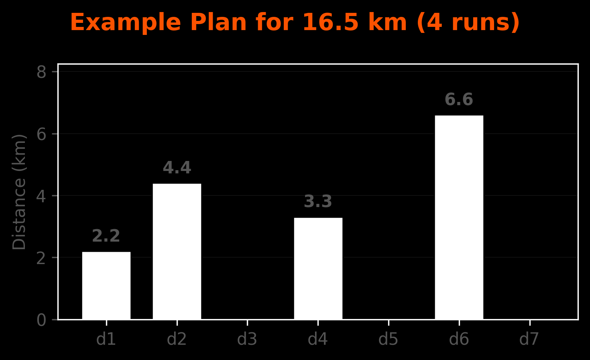

  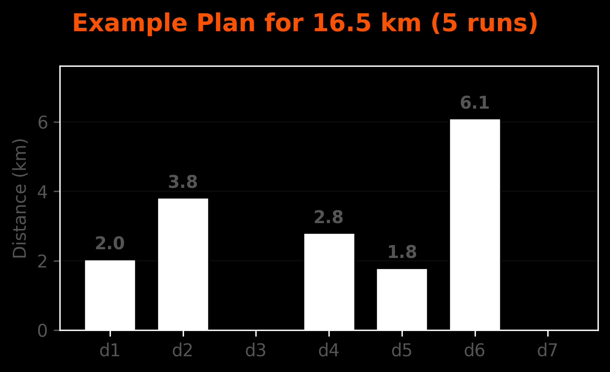

---
### Current/Next Week Plans
> These plots automatically update and show the ran runs in white and proposed runs in orange. They try to somewhat stick to schemes plotted above.

  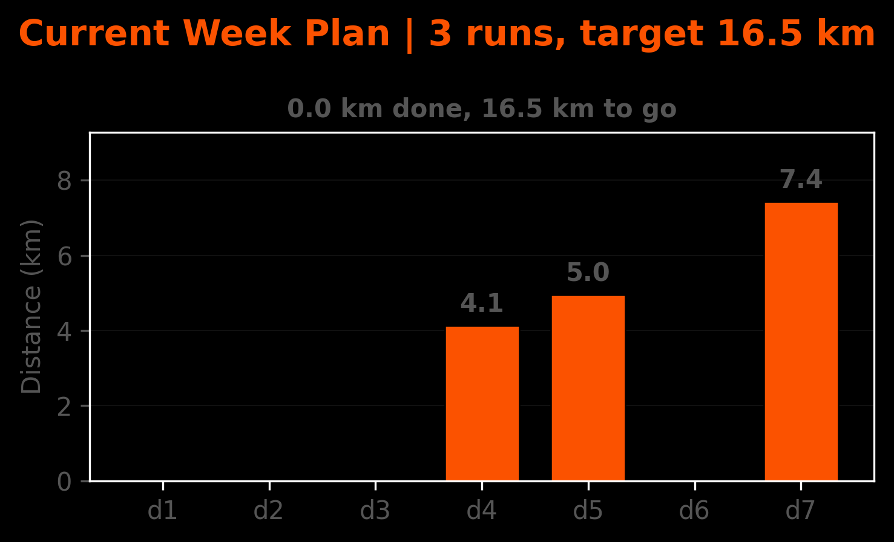

  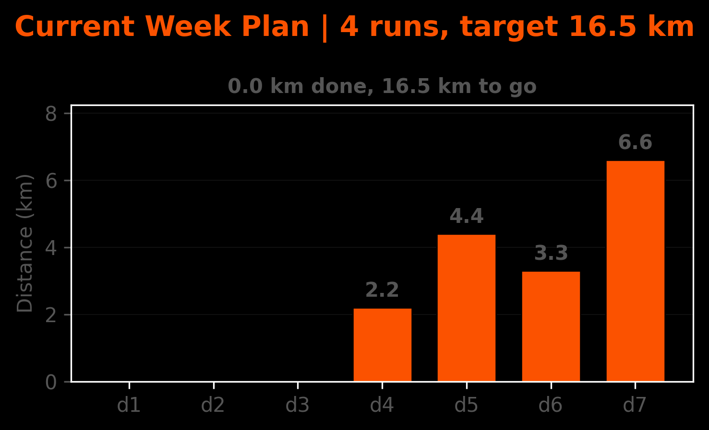

  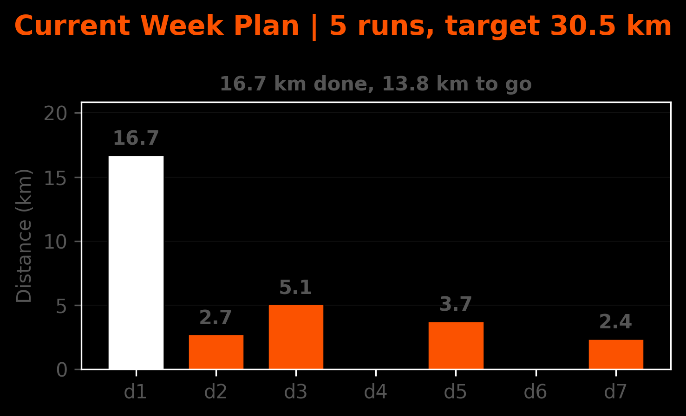

---
### Weekly Stacked Plots
> Stacked barplots, showing run stacks for each week. 

#### Color = Risk 
> Here risk is defined by combining distance from normal distribution. Faster and longer runs contribute to higher risk, slower and shorter to lower risk.

  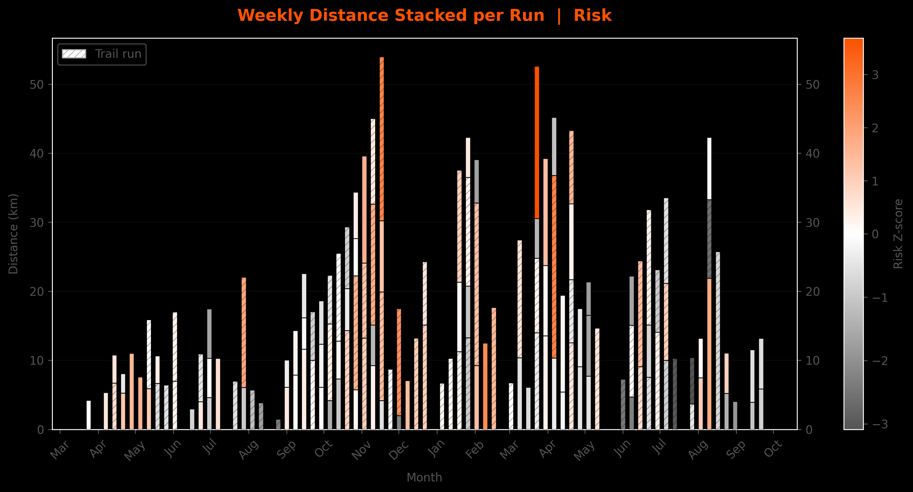

#### Color = Pace 

  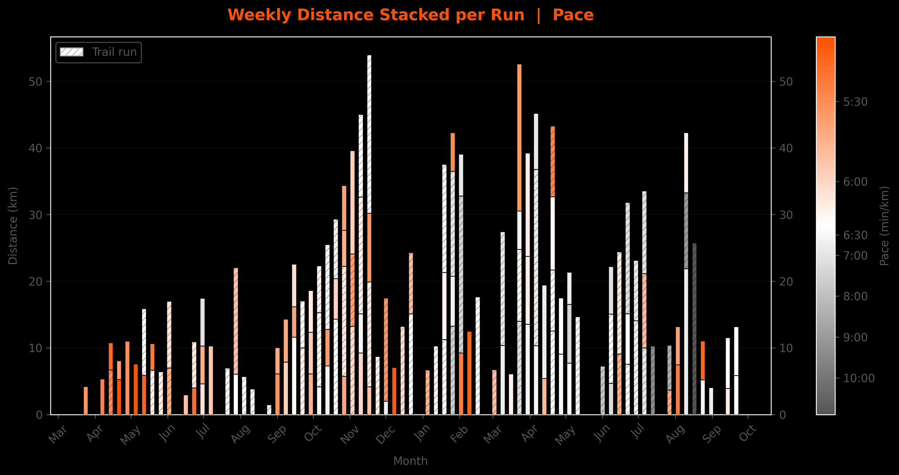

#### Color = Distance 

  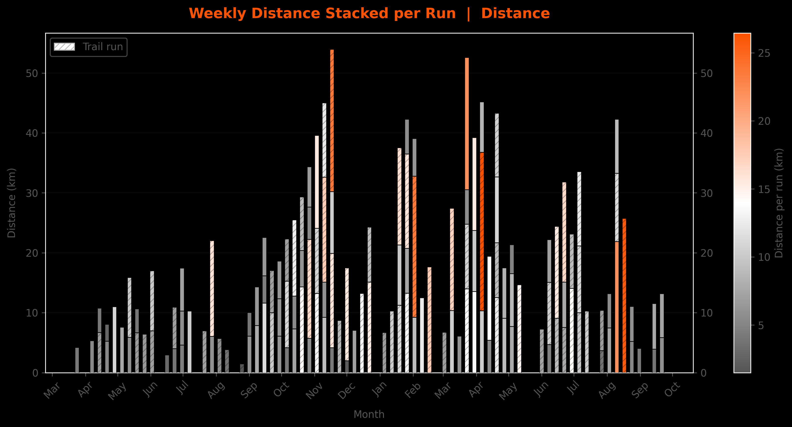

#### Color = Elevation Gain
> Total elevation gain per run (m), on a square-root color scale so everyday 50–200 m runs aren't all dark next to the few mountain runs. The two parts of a split run have no elevation of their own and show dark gray.

  

---
### 🚴 Cycling
> Each bar = one week. Each stack segment = one ride — height is distance, color is average speed (km/h).

  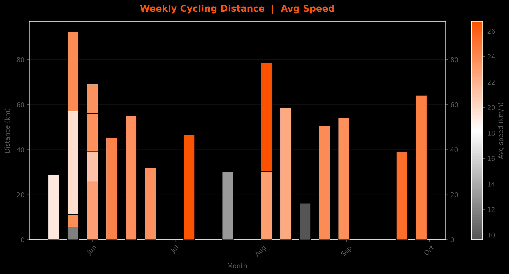

---
### 🥾 Hiking
> Each bar = one week. Each stack segment = one hike — height is distance, color is carried weight (kg, parsed from title / description / private note; 0 if not reported).

  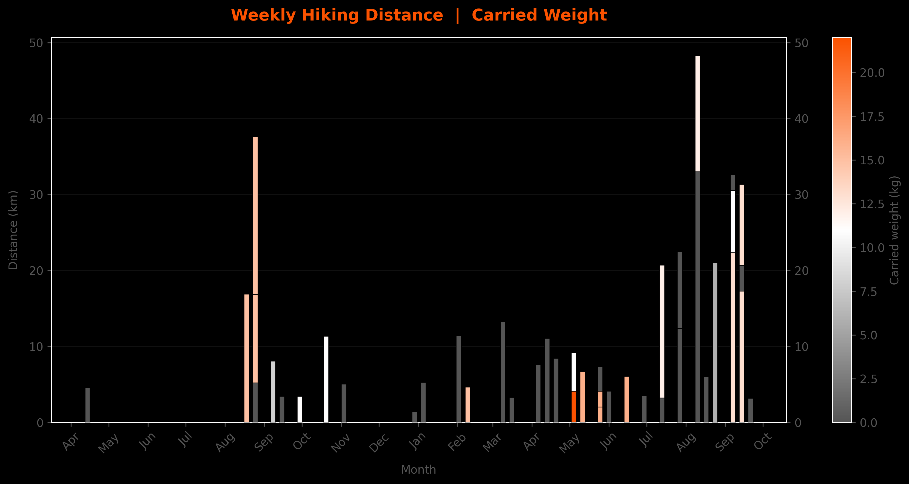

---
### 🏋️ Strength
> Each bar = one week. Each stack segment = one session — height is total volume (kg), color is volume rate (kg/min). Volume is parsed from `NNNN kg volume` in description / private note.

  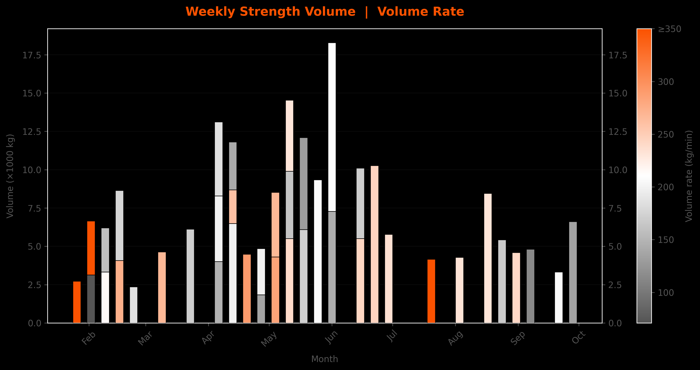

---

