# STRAVA DATA: Weekly Running Plans & Progress
###### Joey Spronck
This repository tracks running progress and training plans. All data are updated via strava API.

### Checkout the [plot_updates README](https://github.com/JoeySpronck/strava_data/tree/plot_updates/README.md) for automatically updated figures (via github actions).

---
### 📈 Weekly volume progression
> Based on the 10% rule, but build-up grows at +25%/week while the target stays below the dark-gray dashed line — the highest 3-consecutive-week average volume of the last half year (a previously sustained level). Once a +25% step would reach that line, growth reverts to +10%. The next unreached target (this or next week) is used as the target for the following plots.

  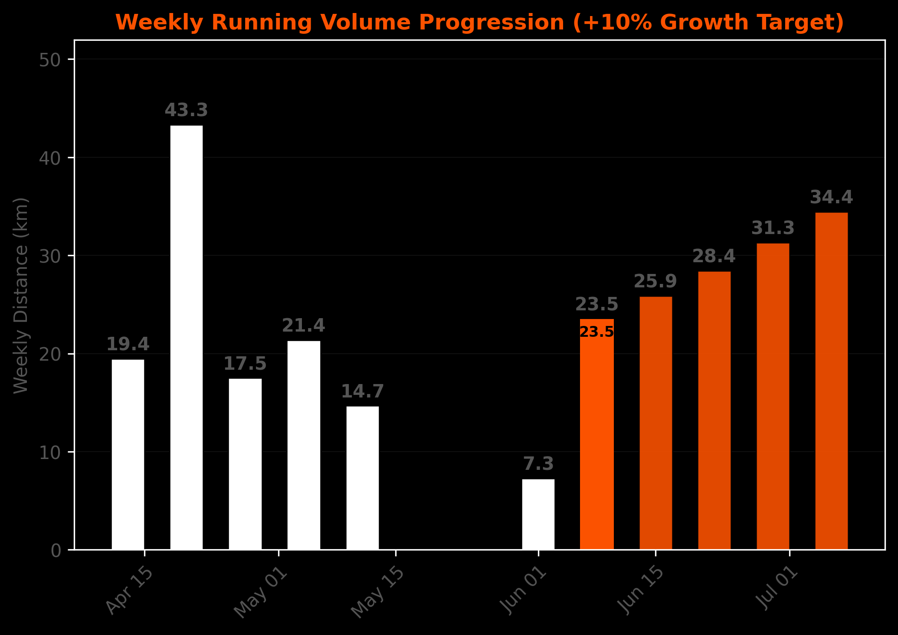

---
### Example Week Plans
> These plots show examples of how a week could be divided into multiple runs, given the target mileage.

  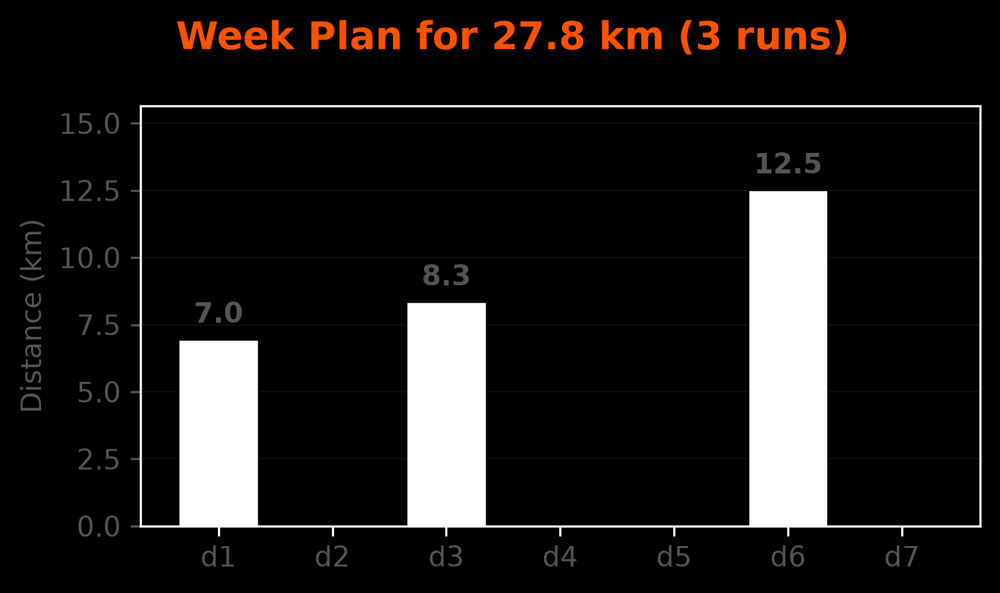

  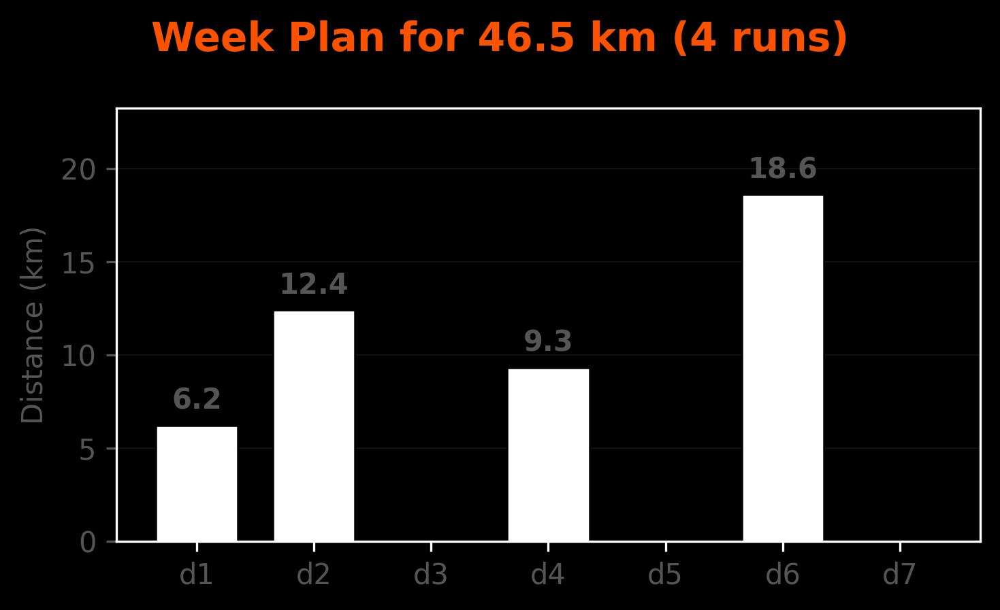

  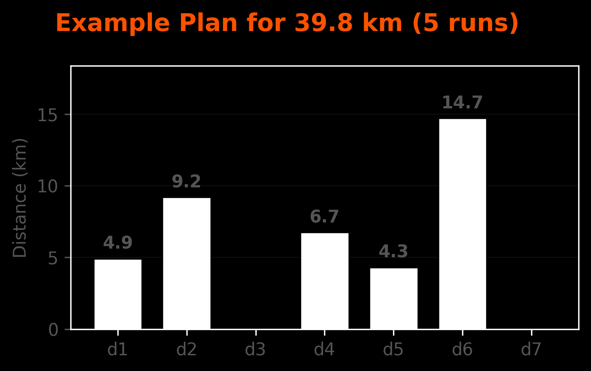

---
### Current/Next Week Plans
> These plots automatically update and show the ran runs in white and proposed runs in orange. They try to somewhat stick to schemes plotted above.

  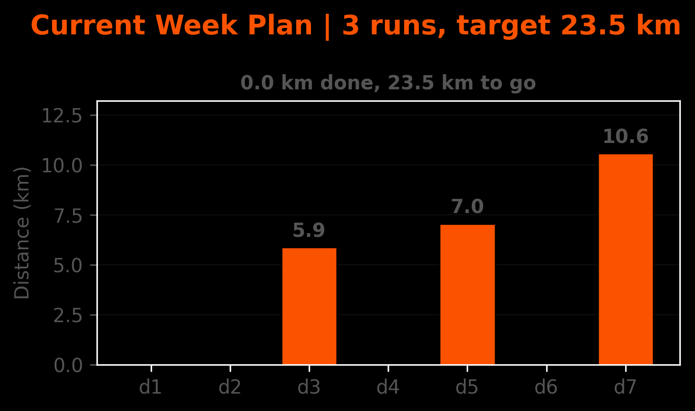

  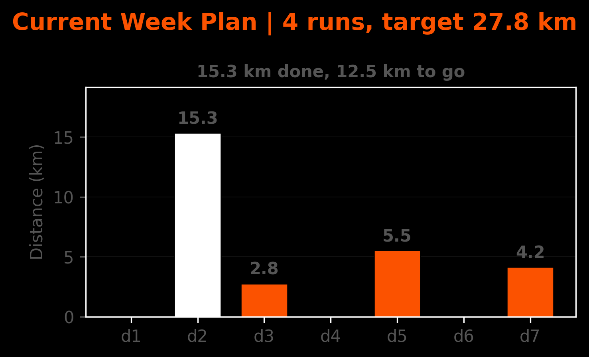

  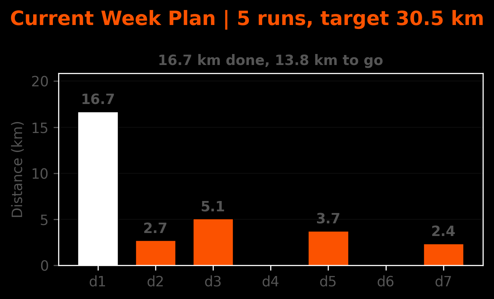

---
### Weekly Stacked Plots
> Stacked barplots, showing run stacks for each week. 

#### Color = Risk 
> Here risk is defined by combining distance from normal distribution. Faster and longer runs contribute to higher risk, slower and shorter to lower risk.

  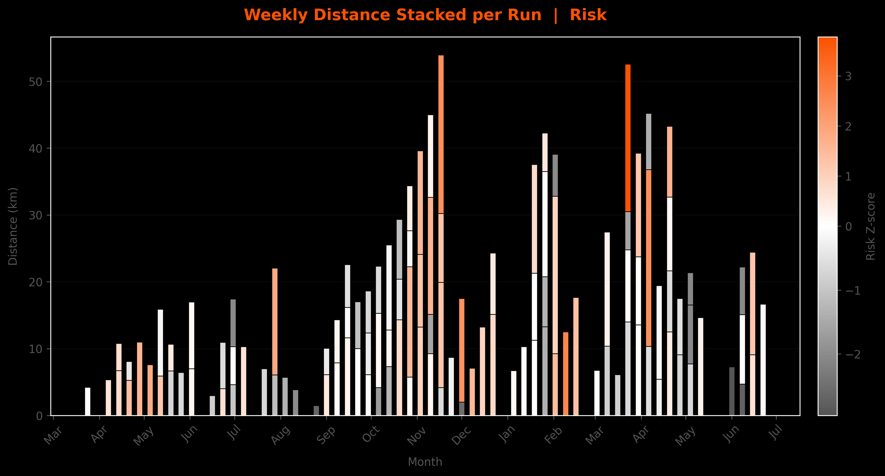

#### Color = Pace 

  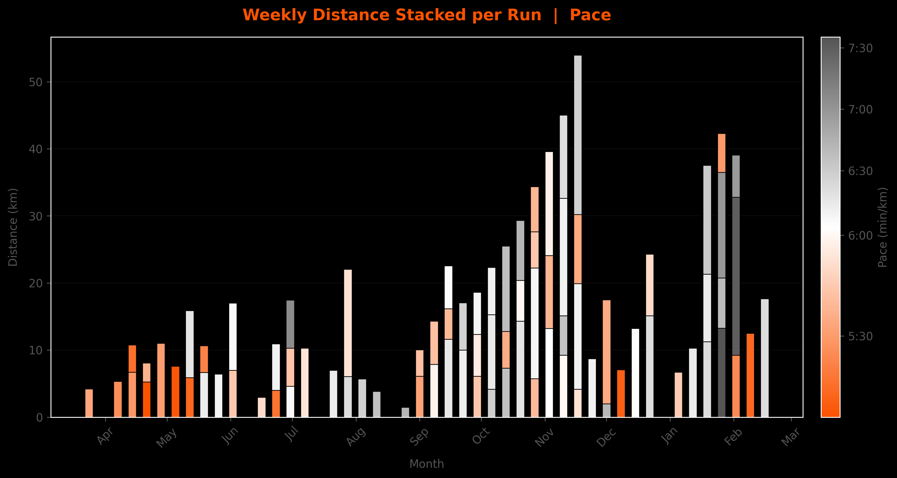

#### Color = Distance 

  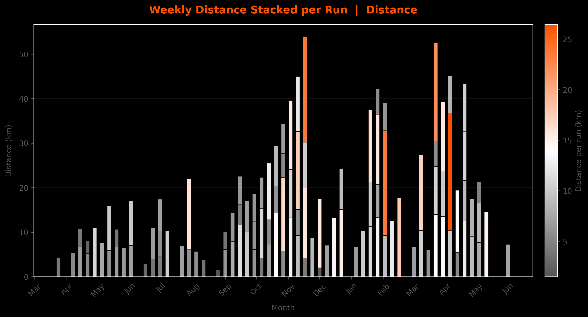

---
### 🚴 Cycling
> Each bar = one week. Each stack segment = one ride — height is distance, color is average speed (km/h).

  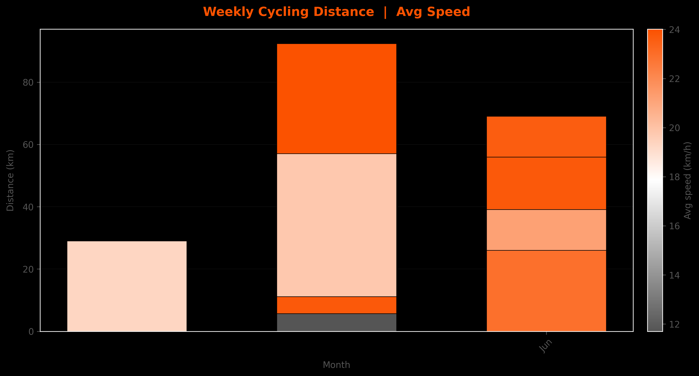

---
### 🥾 Hiking
> Each bar = one week. Each stack segment = one hike — height is distance, color is carried weight (kg, parsed from title / description / private note; 0 if not reported).

  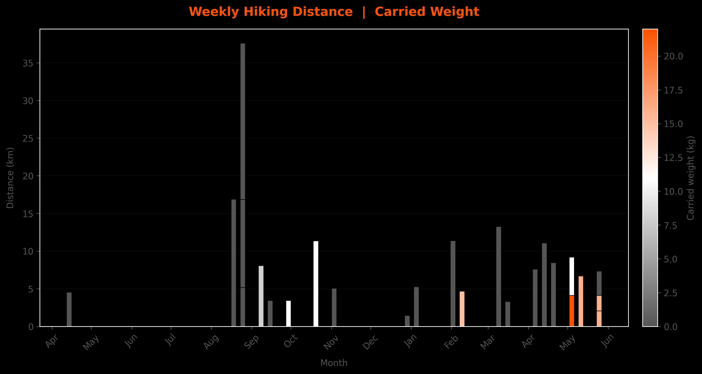

---
### 🏋️ Strength
> Each bar = one week. Each stack segment = one session — height is total volume (kg), color is session time (min). Volume is parsed from `NNNN kg volume` in description / private note.

  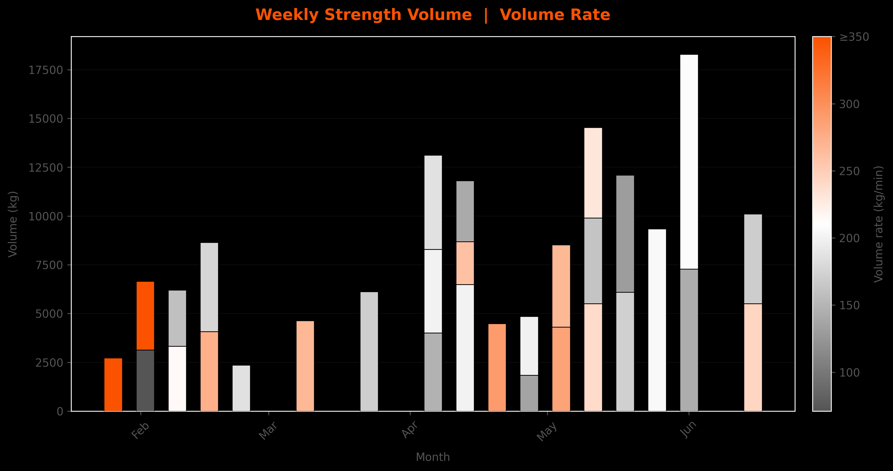

---
### 🏃🚴🥾🏋️ All-Sports Overview
> Running, cycling, hiking, and strength stacked on a shared time axis. Color encodes speed (run/ride), carried weight (hike), and session time (strength).

  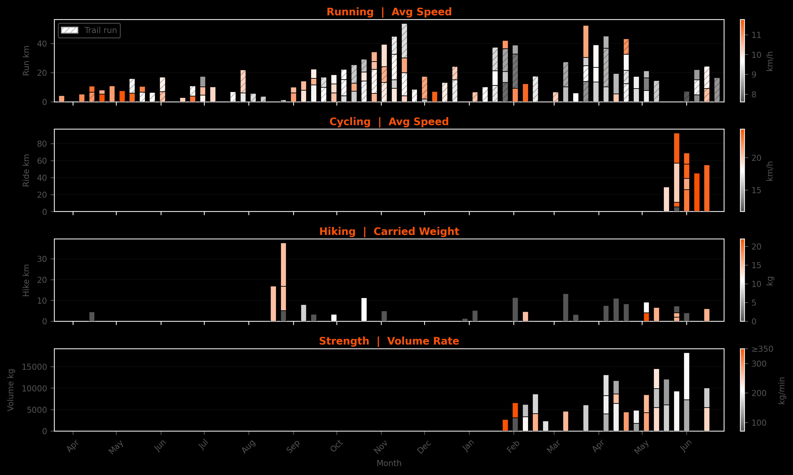

---
### 📅 Monthly Activity Calendar
> Strava-style month view: each day is a circle, filled on activity days (letter = sport: **T**rail, **R**un, **H**ike, **S**trength, **B**ike). Color and size follow the overview's metric scale and bar magnitude. All months archived in [`CALENDAR_PLOTS.md`](CALENDAR_PLOTS.md).

#### This month

  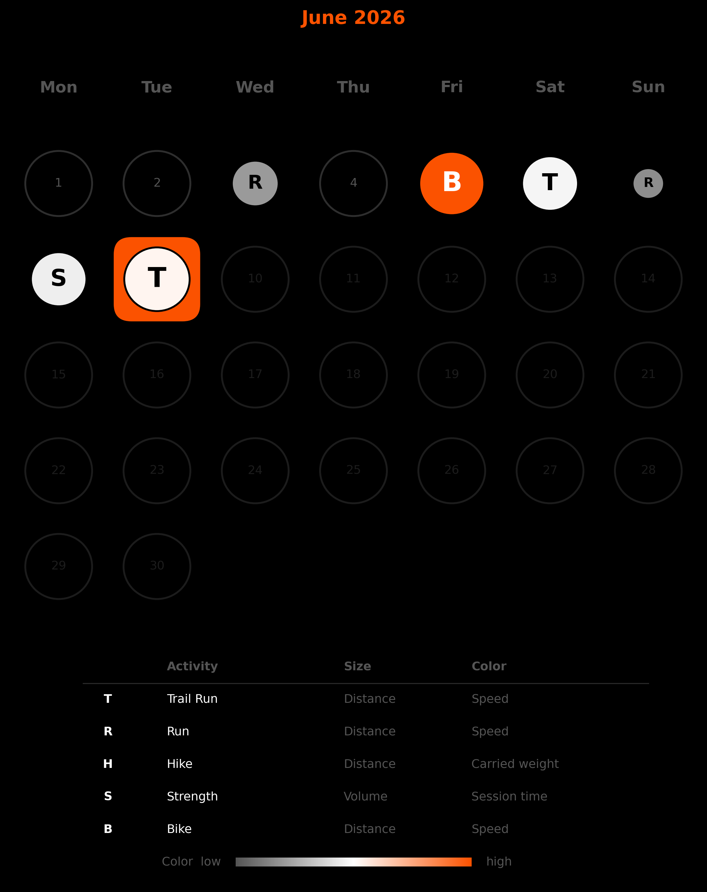

#### Previous month

  

---

