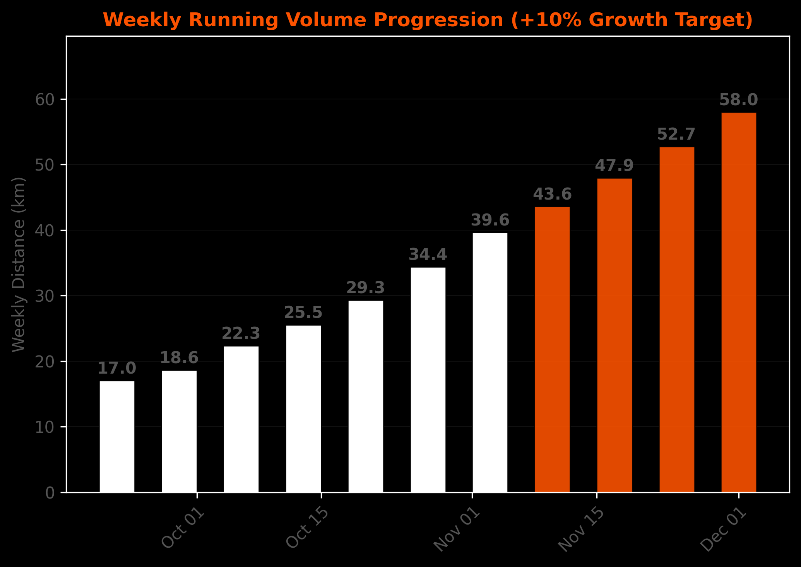
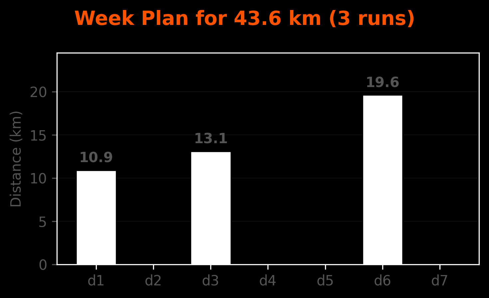
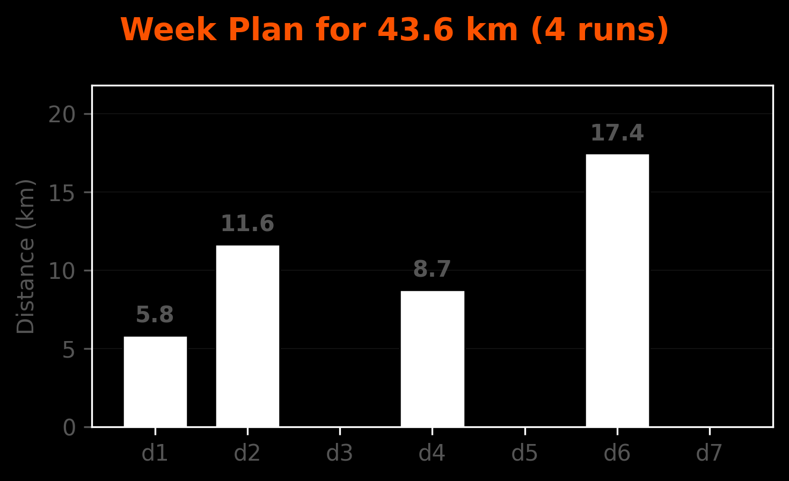
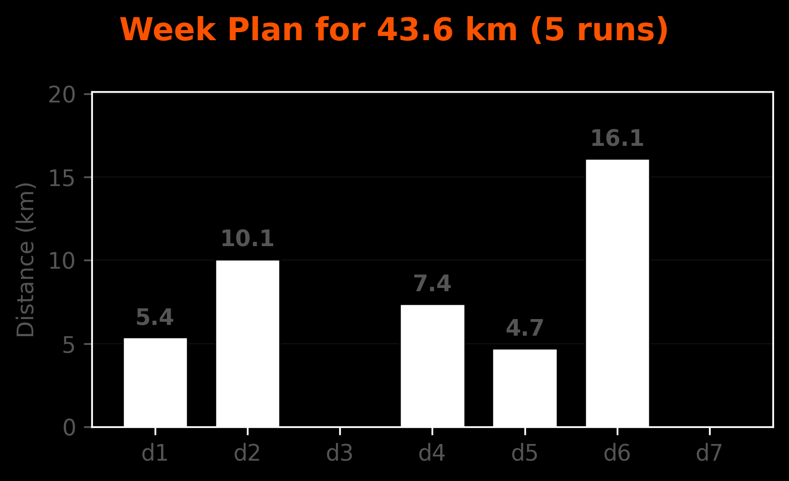
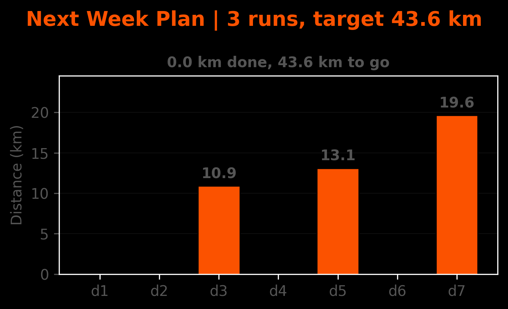
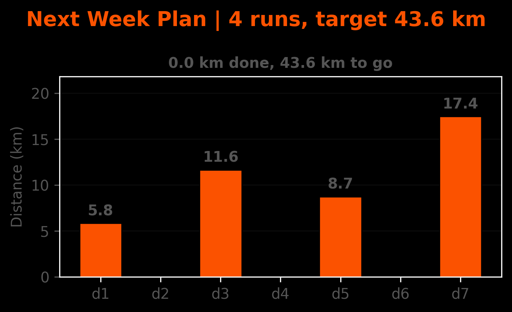
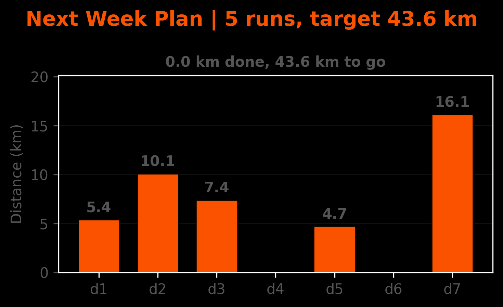
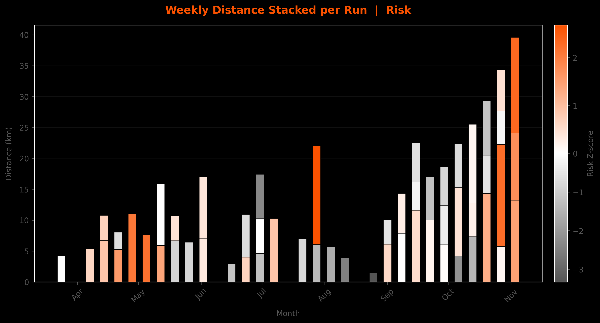
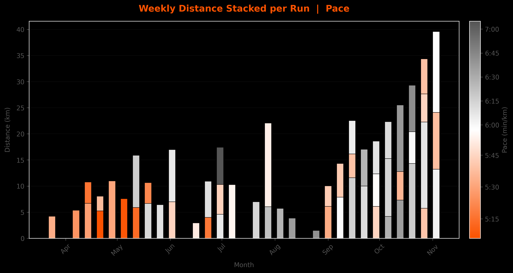
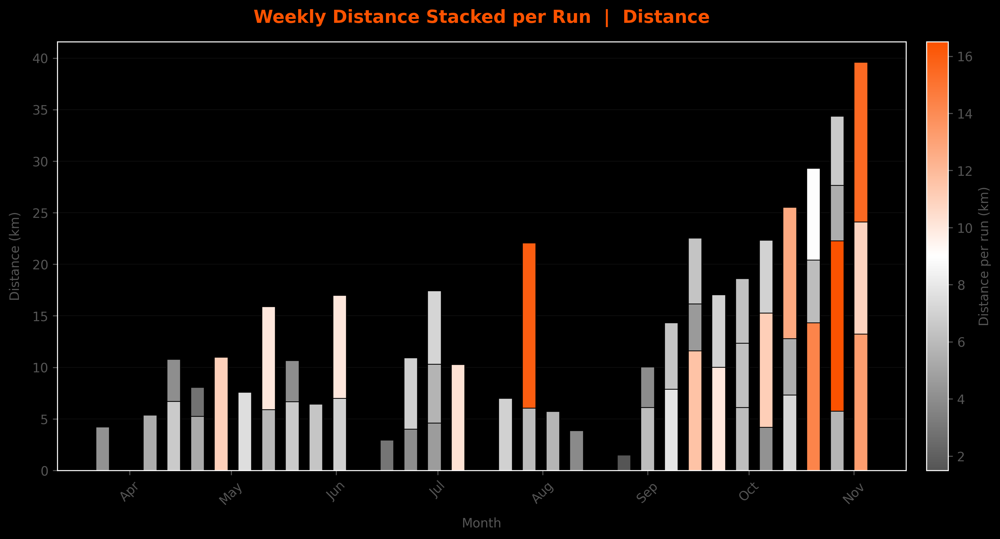

# STRAVA DATA: Weekly Running Plans & Progress
###### Joey Spronck
This repository tracks running progress and training plans. All data are updated via strava API.

## Checkout the [plot_updates README](https://github.com/JoeySpronck/strava_data/tree/plot_updates/README.md)
For automatically updated figures (via github actions).

---
### 📈 Weekly volume progression
###### Based on 10% rule. The next unreached target (this or next week) will be used as target for following plots

  

---
### Example Week Plans
###### These plots show examples of how a week could be divided into multiple runs, given the target mileage.

  

  

  

---
### Current/Next Week Plans
###### These plots automatically update and show the ran runs in white and proposed runs in orange. They try to somewhat stick to schemes plotted above.

  

  

  

---
### Weekly Stacked Plots
###### Stacked barplots, showing run stacks for each week. 

#### Color = Risk 
###### Here risk is defined by combining distance from normal distribution. Faster and longer runs contribute to higher risk, slower and shorter to lower risk.

  

#### Color = Pace 

  

#### Color = Distance 

  

---

